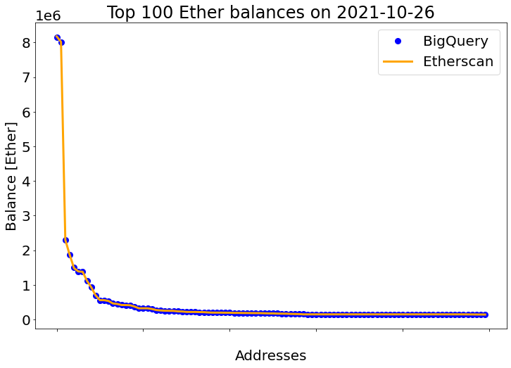
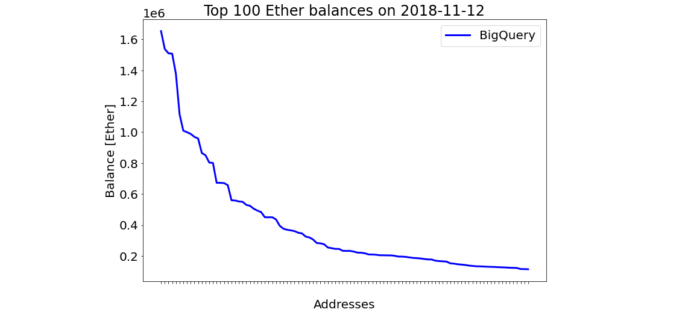
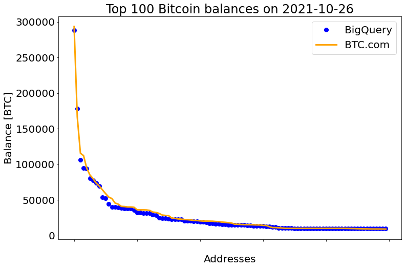

```python
import pandas as pd
import matplotlib.pyplot as plt
```

Top 100 Ether balances obtained from Ethereum public datasets (the corresponding table contains Ether balances of all addresses, updated daily) on Google Cloud using BigQuery:
``` mysql
SELECT *
FROM `bigquery-public-data.crypto_ethereum.balances`
WHERE eth_balance > 0
ORDER BY eth_balance DESC 
LIMIT 100
```


```python
bq_eth_df = pd.read_json('daily_top_100_eth_balances_[25 Oct 2021, 13:49:26 UTC+1]_results-20211026-090241.json')
bq_eth_df.rename(columns={'eth_balance': 'balance'}, inplace=True)
bq_eth_df['balance'] /= 10**18  # convert Wei to Ether
bq_eth_df
```


<div>
<style scoped>
    .dataframe tbody tr th:only-of-type {
        vertical-align: middle;
    }

    .dataframe tbody tr th {
        vertical-align: top;
    }

    .dataframe thead th {
        text-align: right;
    }
</style>
<table border="1" class="dataframe">
  <thead>
    <tr style="text-align: right;">
      <th></th>
      <th>address</th>
      <th>balance</th>
    </tr>
  </thead>
  <tbody>
    <tr>
      <th>0</th>
      <td>0xc02aaa39b223fe8d0a0e5c4f27ead9083c756cc2</td>
      <td>8.139444e+06</td>
    </tr>
    <tr>
      <th>1</th>
      <td>0x00000000219ab540356cbb839cbe05303d7705fa</td>
      <td>8.011266e+06</td>
    </tr>
    <tr>
      <th>2</th>
      <td>0xbe0eb53f46cd790cd13851d5eff43d12404d33e8</td>
      <td>2.296896e+06</td>
    </tr>
    <tr>
      <th>3</th>
      <td>0x73bceb1cd57c711feac4224d062b0f6ff338501e</td>
      <td>1.874773e+06</td>
    </tr>
    <tr>
      <th>4</th>
      <td>0x4ddc2d193948926d02f9b1fe9e1daa0718270ed5</td>
      <td>1.499808e+06</td>
    </tr>
    <tr>
      <th>...</th>
      <td>...</td>
      <td>...</td>
    </tr>
    <tr>
      <th>95</th>
      <td>0xd05e6bf1a00b5b4c9df909309f19e29af792422b</td>
      <td>1.500000e+05</td>
    </tr>
    <tr>
      <th>96</th>
      <td>0x2fa9f9efc767650aace0422668444c3ff63e1f8d</td>
      <td>1.485317e+05</td>
    </tr>
    <tr>
      <th>97</th>
      <td>0xd57479b8287666b44978255f1677e412d454d4f0</td>
      <td>1.476994e+05</td>
    </tr>
    <tr>
      <th>98</th>
      <td>0xc6dcb7ac175636cbc3d5f32c68865c24ca7d74d4</td>
      <td>1.461931e+05</td>
    </tr>
    <tr>
      <th>99</th>
      <td>0x4baf012726cb5ec7dda57bc2770798a38100c44d</td>
      <td>1.450001e+05</td>
    </tr>
  </tbody>
</table>
<p>100 rows × 2 columns</p>
</div>


The following is obtained from [Etherscan.io](https://etherscan.io/accounts):


```python
etherscan_df = pd.read_csv('etherscan_top_100_balances_[2021-10-26 10:56:12 IST].csv', header=0)
etherscan_df
```


<div>
<style scoped>
    .dataframe tbody tr th:only-of-type {
        vertical-align: middle;
    }

    .dataframe tbody tr th {
        vertical-align: top;
    }

    .dataframe thead th {
        text-align: right;
    }
</style>
<table border="1" class="dataframe">
  <thead>
    <tr style="text-align: right;">
      <th></th>
      <th>address</th>
      <th>balance</th>
    </tr>
  </thead>
  <tbody>
    <tr>
      <th>0</th>
      <td>0xc02aaa39b223fe8d0a0e5c4f27ead9083c756cc2</td>
      <td>8.175899e+06</td>
    </tr>
    <tr>
      <th>1</th>
      <td>0x00000000219ab540356cbb839cbe05303d7705fa</td>
      <td>8.018114e+06</td>
    </tr>
    <tr>
      <th>2</th>
      <td>0xbe0eb53f46cd790cd13851d5eff43d12404d33e8</td>
      <td>2.296896e+06</td>
    </tr>
    <tr>
      <th>3</th>
      <td>0x73bceb1cd57c711feac4224d062b0f6ff338501e</td>
      <td>1.874773e+06</td>
    </tr>
    <tr>
      <th>4</th>
      <td>0x4ddc2d193948926d02f9b1fe9e1daa0718270ed5</td>
      <td>1.485087e+06</td>
    </tr>
    <tr>
      <th>...</th>
      <td>...</td>
      <td>...</td>
    </tr>
    <tr>
      <th>95</th>
      <td>0x2fa9f9efc767650aace0422668444c3ff63e1f8d</td>
      <td>1.485317e+05</td>
    </tr>
    <tr>
      <th>96</th>
      <td>0xd57479b8287666b44978255f1677e412d454d4f0</td>
      <td>1.476994e+05</td>
    </tr>
    <tr>
      <th>97</th>
      <td>0xc6dcb7ac175636cbc3d5f32c68865c24ca7d74d4</td>
      <td>1.461931e+05</td>
    </tr>
    <tr>
      <th>98</th>
      <td>0x4baf012726cb5ec7dda57bc2770798a38100c44d</td>
      <td>1.450001e+05</td>
    </tr>
    <tr>
      <th>99</th>
      <td>0x3dfd23a6c5e8bbcfc9581d2e864a68feb6a076d3</td>
      <td>1.443559e+05</td>
    </tr>
  </tbody>
</table>
<p>100 rows × 2 columns</p>
</div>


```python
plt.rcParams.update({'font.size': 20})
plt.figure(figsize=(12, 8))
plt.title('Top 100 Ether balances on 2021-10-26')
plt.xlabel('Addresses')
plt.ylabel('Balance [Ether]')
plt.xticks(color='w')
plt.plot(bq_eth_df['balance'], marker='o', markersize='8', color='blue', linestyle='', label='BigQuery')
plt.plot(etherscan_df['balance'], linestyle='-', linewidth=3, color='orange', label='Etherscan')
plt.legend()
plt.show()
```


    

    


To get top Ether balances for a given date (e.g. 2018-11-12), the following query shall be used (see [awesome-bigquery-views](https://github.com/blockchain-etl/awesome-bigquery-views#top-ethereum-balances) for details):
``` mysql
#standardSQL
with double_entry_book as (
    -- debits
    select to_address as address, value as value
    from `bigquery-public-data.crypto_ethereum.traces`
    where to_address is not null
    and status = 1
    and value > 0
    and date(block_timestamp) < "2018-11-13"
    and (call_type not in ('delegatecall', 'callcode', 'staticcall') or call_type is null)
    union all -- combines results from different 'selects' with duplicates
    -- credits
    select from_address as address, -value as value
    from `bigquery-public-data.crypto_ethereum.traces`
    where from_address is not null
    and status = 1
    and value > 0
    and date(block_timestamp) < "2018-11-13"
    and (call_type not in ('delegatecall', 'callcode', 'staticcall') or call_type is null)
    union all
    -- transaction fees debits
    -- select miner as address, sum(cast(receipt_gas_used as numeric) * cast(gas_price as numeric)) as value
    select miner as address, sum(cast(receipt_gas_used as numeric) * cast((receipt_effective_gas_price - coalesce(base_fee_per_gas, 0)) as numeric)) as value
    from `bigquery-public-data.crypto_ethereum.transactions` as transactions
    join `bigquery-public-data.crypto_ethereum.blocks` as blocks on blocks.number = transactions.block_number
    group by blocks.miner
    union all
    -- transaction fees credits
    select from_address as address, -(cast(receipt_gas_used as numeric) * cast(gas_price as numeric)) as value
    from `bigquery-public-data.crypto_ethereum.transactions`
)
select address, sum(value) as balance
from double_entry_book
group by address
order by balance desc
limit 100
```
The resultts for this query are as follows:


```python
bq_eth_df = pd.read_json('top_100_eth_balances_[2018-11-12]_results-20211026-103524.json')
bq_eth_df['balance'] /= 10**18  # convert Wei to Ether
bq_eth_df
```


<div>
<style scoped>
    .dataframe tbody tr th:only-of-type {
        vertical-align: middle;
    }

    .dataframe tbody tr th {
        vertical-align: top;
    }

    .dataframe thead th {
        text-align: right;
    }
</style>
<table border="1" class="dataframe">
  <thead>
    <tr style="text-align: right;">
      <th></th>
      <th>address</th>
      <th>balance</th>
    </tr>
  </thead>
  <tbody>
    <tr>
      <th>0</th>
      <td>0x742d35cc6634c0532925a3b844bc454e4438f44e</td>
      <td>1.653529e+06</td>
    </tr>
    <tr>
      <th>1</th>
      <td>0x281055afc982d96fab65b3a49cac8b878184cb16</td>
      <td>1.538423e+06</td>
    </tr>
    <tr>
      <th>2</th>
      <td>0x6f46cf5569aefa1acc1009290c8e043747172d89</td>
      <td>1.510066e+06</td>
    </tr>
    <tr>
      <th>3</th>
      <td>0x90e63c3d53e0ea496845b7a03ec7548b70014a91</td>
      <td>1.507810e+06</td>
    </tr>
    <tr>
      <th>4</th>
      <td>0x53d284357ec70ce289d6d64134dfac8e511c8a3d</td>
      <td>1.378754e+06</td>
    </tr>
    <tr>
      <th>...</th>
      <td>...</td>
      <td>...</td>
    </tr>
    <tr>
      <th>95</th>
      <td>0x47029dc4f3922706bf670d335c45550cff4f6a35</td>
      <td>1.228616e+05</td>
    </tr>
    <tr>
      <th>96</th>
      <td>0xddf744374b46aa980ddce4a5aa216478bf925cd1</td>
      <td>1.218604e+05</td>
    </tr>
    <tr>
      <th>97</th>
      <td>0xd224ca0c819e8e97ba0136b3b95ceff503b79f53</td>
      <td>1.149793e+05</td>
    </tr>
    <tr>
      <th>98</th>
      <td>0x376c3e5547c68bc26240d8dcc6729fff665a4448</td>
      <td>1.149390e+05</td>
    </tr>
    <tr>
      <th>99</th>
      <td>0xa1a45e91164cdab8fa596809a9b24f8d4fdbe0f3</td>
      <td>1.137622e+05</td>
    </tr>
  </tbody>
</table>
<p>100 rows × 2 columns</p>
</div>


```python
plt.rcParams.update({'font.size': 20})
plt.figure(figsize=(12, 8))
plt.title('Top 100 Ether balances on 2018-11-12')
plt.xlabel('Addresses')
plt.ylabel('Balance [Ether]')
plt.xticks(color='w')
plt.plot(bq_eth_df['address'], bq_eth_df['balance'], color='blue', linestyle='-', linewidth=3, label='BigQuery')
plt.legend()
plt.show()
```


    

    


To get top Bitcoin balances, we can use (see [awesome-bigquery-views](https://github.com/blockchain-etl/awesome-bigquery-views#top-bitcoin-balances) for details):
``` mysql
WITH double_entry_book AS (
   -- debits
   SELECT array_to_string(inputs.addresses, ",") as address, inputs.type, -inputs.value as value
   FROM `bigquery-public-data.crypto_bitcoin.inputs` as inputs
   -- WHERE DATE(inputs.block_timestamp) < "2018-11-13"
   UNION ALL
   -- credits
   SELECT array_to_string(outputs.addresses, ",") as address, outputs.type, outputs.value as value
   FROM `bigquery-public-data.crypto_bitcoin.outputs` as outputs
   -- WHERE DATE(outputs.block_timestamp) < "2018-11-13"
)
SELECT address, type, sum(value) as balance
FROM double_entry_book
GROUP BY address, type
ORDER BY balance DESC
LIMIT 100
```
which gave the following results


```python
bq_btc_df = pd.read_json('daily_top_100_btc_balances_[25 Oct 2021, 13:36:04 UTC+1 ]_results-20211026-104433.json')
bq_btc_df['balance'] /= 10**8  # convert Satoshi to BTC
bq_btc_df
```


<div>
<style scoped>
    .dataframe tbody tr th:only-of-type {
        vertical-align: middle;
    }

    .dataframe tbody tr th {
        vertical-align: top;
    }

    .dataframe thead th {
        text-align: right;
    }
</style>
<table border="1" class="dataframe">
  <thead>
    <tr style="text-align: right;">
      <th></th>
      <th>address</th>
      <th>type</th>
      <th>balance</th>
    </tr>
  </thead>
  <tbody>
    <tr>
      <th>0</th>
      <td>34xp4vRoCGJym3xR7yCVPFHoCNxv4Twseo</td>
      <td>scripthash</td>
      <td>288126.209985</td>
    </tr>
    <tr>
      <th>1</th>
      <td>bc1qgdjqv0av3q56jvd82tkdjpy7gdp9ut8tlqmgrpmv24...</td>
      <td>witness_v0_scripthash</td>
      <td>178010.985449</td>
    </tr>
    <tr>
      <th>2</th>
      <td>1P5ZEDWTKTFGxQjZphgWPQUpe554WKDfHQ</td>
      <td>pubkeyhash</td>
      <td>106354.574363</td>
    </tr>
    <tr>
      <th>3</th>
      <td>37XuVSEpWW4trkfmvWzegTHQt7BdktSKUs</td>
      <td>scripthash</td>
      <td>94505.114067</td>
    </tr>
    <tr>
      <th>4</th>
      <td>38UmuUqPCrFmQo4khkomQwZ4VbY2nZMJ67</td>
      <td>scripthash</td>
      <td>93566.021928</td>
    </tr>
    <tr>
      <th>...</th>
      <td>...</td>
      <td>...</td>
      <td>...</td>
    </tr>
    <tr>
      <th>95</th>
      <td>bc1qyr9dsfyst3epqycghpxshfmgy8qfzadfhp8suk</td>
      <td>witness_v0_keyhash</td>
      <td>9900.451786</td>
    </tr>
    <tr>
      <th>96</th>
      <td>bc1q8qg2eazryu9as20k3hveuvz43thp200g7nw7qy</td>
      <td>witness_v0_keyhash</td>
      <td>9900.098341</td>
    </tr>
    <tr>
      <th>97</th>
      <td>bc1q4ffskt6879l4ewffrrflpykvphshl9la4q037h</td>
      <td>witness_v0_keyhash</td>
      <td>9895.369770</td>
    </tr>
    <tr>
      <th>98</th>
      <td>bc1qa56lzf7d05ttur003zmuzwrgl3x0qau5zm2qzn</td>
      <td>witness_v0_keyhash</td>
      <td>9887.714116</td>
    </tr>
    <tr>
      <th>99</th>
      <td>134ooU6EQmCFFzEPN7yga3S1XikcBtynco</td>
      <td>pubkeyhash</td>
      <td>9866.702280</td>
    </tr>
  </tbody>
</table>
<p>100 rows × 3 columns</p>
</div>


The following is obtained from [BTC.com](https://btc.com/stats/rich-list):


```python
btc_df = pd.read_csv('BTCcom_top_100_balances_[2021-10-26 12:07:14 IST].csv', header=0)
btc_df
```


<div>
<style scoped>
    .dataframe tbody tr th:only-of-type {
        vertical-align: middle;
    }

    .dataframe tbody tr th {
        vertical-align: top;
    }

    .dataframe thead th {
        text-align: right;
    }
</style>
<table border="1" class="dataframe">
  <thead>
    <tr style="text-align: right;">
      <th></th>
      <th>address</th>
      <th>balance</th>
    </tr>
  </thead>
  <tbody>
    <tr>
      <th>0</th>
      <td>34xp4vRoCGJym3xR7yCVPFHoCNxv4Twseo</td>
      <td>293427.057899</td>
    </tr>
    <tr>
      <th>1</th>
      <td>bc1qgdjqv0av3q56jvd82tkdjpy7gdp9ut8...</td>
      <td>166510.985836</td>
    </tr>
    <tr>
      <th>2</th>
      <td>35hK24tcLEWcgNA4JxpvbkNkoAcDGqQPsP</td>
      <td>115451.667857</td>
    </tr>
    <tr>
      <th>3</th>
      <td>1P5ZEDWTKTFGxQjZphgWPQUpe554WKDfHQ</td>
      <td>112155.617716</td>
    </tr>
    <tr>
      <th>4</th>
      <td>37XuVSEpWW4trkfmvWzegTHQt7BdktSKUs</td>
      <td>94505.831979</td>
    </tr>
    <tr>
      <th>...</th>
      <td>...</td>
      <td>...</td>
    </tr>
    <tr>
      <th>95</th>
      <td>bc1qh4cpaydaqlzez8ekkasm3ygj4us7gwx...</td>
      <td>9111.905706</td>
    </tr>
    <tr>
      <th>96</th>
      <td>17CzhFvGwH6TT46JtzhnhMpTw4mHYpEGCR</td>
      <td>9107.364474</td>
    </tr>
    <tr>
      <th>97</th>
      <td>bc1q78wmm8xnhveklsparpeq6drlg9wlq4l...</td>
      <td>9098.999109</td>
    </tr>
    <tr>
      <th>98</th>
      <td>1Cr7EjvS8C7gfarREHCvFhd9gT3r46pfLb</td>
      <td>9049.832927</td>
    </tr>
    <tr>
      <th>99</th>
      <td>1J1F3U7gHrCjsEsRimDJ3oYBiV24wA8FuV</td>
      <td>9000.000000</td>
    </tr>
  </tbody>
</table>
<p>100 rows × 2 columns</p>
</div>


```python
plt.rcParams.update({'font.size': 20})
plt.figure(figsize=(12, 8))
plt.title('Top 100 Bitcoin balances on 2021-10-26')
plt.xlabel('Addresses')
plt.ylabel('Balance [BTC]')
plt.xticks(color='w')
plt.plot(bq_btc_df['balance'], marker='o', markersize='8', color='blue', linestyle='', label='BigQuery')
plt.plot(btc_df['balance'], linestyle='-', linewidth=3, color='orange', label='BTC.com')
plt.legend()
plt.show()
```


    

    


```python

```
