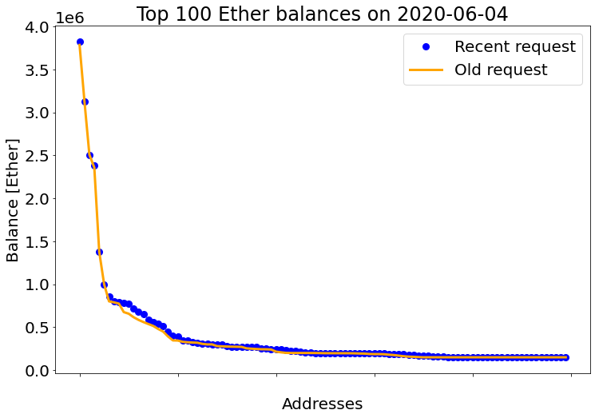
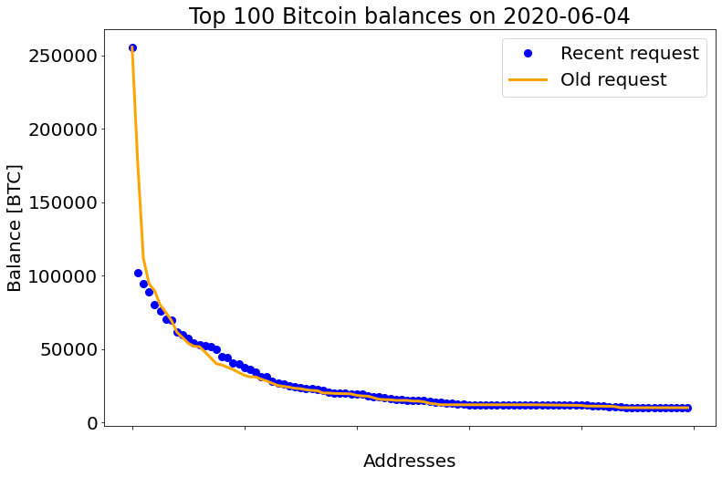

```python
import pandas as pd
import matplotlib.pyplot as plt
```

Top 100 Ether and Bitcoin balances obtained by Bart on June 4, 2020:


```python
old_df = pd.read_csv('Barts_data.csv')
old_df
```


<div>
<table border="1" class="dataframe">
  <thead>
    <tr style="text-align: right;">
      <th></th>
      <th>ETH</th>
      <th>BTC</th>
    </tr>
  </thead>
  <tbody>
    <tr>
      <th>0</th>
      <td>3.785986e+06</td>
      <td>255502.151153</td>
    </tr>
    <tr>
      <th>1</th>
      <td>3.125761e+06</td>
      <td>176500.999634</td>
    </tr>
    <tr>
      <th>2</th>
      <td>2.507764e+06</td>
      <td>111858.247990</td>
    </tr>
    <tr>
      <th>3</th>
      <td>2.358939e+06</td>
      <td>94505.768824</td>
    </tr>
    <tr>
      <th>4</th>
      <td>1.378754e+06</td>
      <td>89684.306228</td>
    </tr>
    <tr>
      <th>...</th>
      <td>...</td>
      <td>...</td>
    </tr>
    <tr>
      <th>95</th>
      <td>1.500000e+05</td>
      <td>10000.010407</td>
    </tr>
    <tr>
      <th>96</th>
      <td>1.500000e+05</td>
      <td>10000.010261</td>
    </tr>
    <tr>
      <th>97</th>
      <td>1.500000e+05</td>
      <td>10000.010243</td>
    </tr>
    <tr>
      <th>98</th>
      <td>1.500000e+05</td>
      <td>10000.010243</td>
    </tr>
    <tr>
      <th>99</th>
      <td>1.500000e+05</td>
      <td>10000.009325</td>
    </tr>
  </tbody>
</table>
<p>100 rows × 2 columns</p>
</div>


The data about top 100 Ether balances for June 4, 2020 were obtainted using this query:
``` mysql
#standardSQL
DECLARE TARGET_DATE DATE;
SET TARGET_DATE = DATE("2020-06-04");
with double_entry_book as (
    -- debits
    select to_address as address, value as value
    from `bigquery-public-data.crypto_ethereum.traces`
    where to_address is not null
    and status = 1
    and value > 0
    and date(block_timestamp) < TARGET_DATE
    and (call_type not in ('delegatecall', 'callcode', 'staticcall') or call_type is null)
    union all -- combines results from different 'selects' with duplicates
    -- credits
    select from_address as address, -value as value
    from `bigquery-public-data.crypto_ethereum.traces`
    where from_address is not null
    and status = 1
    and value > 0
    and date(block_timestamp) < TARGET_DATE
    and (call_type not in ('delegatecall', 'callcode', 'staticcall') or call_type is null)
    union all
    -- transaction fees debits
    -- select miner as address, sum(cast(receipt_gas_used as numeric) * cast(gas_price as numeric)) as value
    select miner as address, sum(cast(receipt_gas_used as numeric) * cast((receipt_effective_gas_price - coalesce(base_fee_per_gas, 0)) as numeric)) as value
    from `bigquery-public-data.crypto_ethereum.transactions` as transactions
    join `bigquery-public-data.crypto_ethereum.blocks` as blocks on blocks.number = transactions.block_number
    group by blocks.miner
    union all
    -- transaction fees credits
    select from_address as address, -(cast(receipt_gas_used as numeric) * cast(gas_price as numeric)) as value
    from `bigquery-public-data.crypto_ethereum.transactions`
)
select address, sum(value) as balance
from double_entry_book
group by address
order by balance desc
limit 100
```


```python
bq_eth_df = pd.read_csv('eth_2020-06-04.csv')
bq_eth_df['balance'] = bq_eth_df['balance'].astype(float)
bq_eth_df['balance'] /= 10**18  # convert Wei to Ether
bq_eth_df
```


<div>
<table border="1" class="dataframe">
  <thead>
    <tr style="text-align: right;">
      <th></th>
      <th>address</th>
      <th>balance</th>
    </tr>
  </thead>
  <tbody>
    <tr>
      <th>0</th>
      <td>0x742d35cc6634c0532925a3b844bc454e4438f44e</td>
      <td>3.828379e+06</td>
    </tr>
    <tr>
      <th>1</th>
      <td>0xdc76cd25977e0a5ae17155770273ad58648900d3</td>
      <td>3.125760e+06</td>
    </tr>
    <tr>
      <th>2</th>
      <td>0xbe0eb53f46cd790cd13851d5eff43d12404d33e8</td>
      <td>2.507761e+06</td>
    </tr>
    <tr>
      <th>3</th>
      <td>0xc02aaa39b223fe8d0a0e5c4f27ead9083c756cc2</td>
      <td>2.381647e+06</td>
    </tr>
    <tr>
      <th>4</th>
      <td>0x53d284357ec70ce289d6d64134dfac8e511c8a3d</td>
      <td>1.378754e+06</td>
    </tr>
    <tr>
      <th>...</th>
      <td>...</td>
      <td>...</td>
    </tr>
    <tr>
      <th>95</th>
      <td>0x4b4a011c420b91260a272afd91e54accdafdfc1d</td>
      <td>1.500000e+05</td>
    </tr>
    <tr>
      <th>96</th>
      <td>0x367989c660881e1ca693730f7126fe0ffc0963fb</td>
      <td>1.500000e+05</td>
    </tr>
    <tr>
      <th>97</th>
      <td>0xfe01a216234f79cfc3bea7513e457c6a9e50250d</td>
      <td>1.500000e+05</td>
    </tr>
    <tr>
      <th>98</th>
      <td>0x77afe94859163abf0b90725d69e904ea91446c7b</td>
      <td>1.500000e+05</td>
    </tr>
    <tr>
      <th>99</th>
      <td>0xa8dcc0373822b94d7f57326be24ca67bafcaad6b</td>
      <td>1.500000e+05</td>
    </tr>
  </tbody>
</table>
<p>100 rows × 2 columns</p>
</div>


The data about top 100 Bitcoin balances for June 4, 2020 were obtainted using the following query:
``` mysql
DECLARE TARGET_DATE DATE;
SET TARGET_DATE = DATE("2020-06-04");
WITH double_entry_book AS (
   -- debits
   SELECT array_to_string(inputs.addresses, ",") as address, inputs.type, -inputs.value as value
   FROM `bigquery-public-data.crypto_bitcoin.inputs` as inputs
   WHERE DATE(inputs.block_timestamp) < TARGET_DATE
   UNION ALL
   -- credits
   SELECT array_to_string(outputs.addresses, ",") as address, outputs.type, outputs.value as value
   FROM `bigquery-public-data.crypto_bitcoin.outputs` as outputs
   WHERE DATE(outputs.block_timestamp) < TARGET_DATE
)
SELECT address, type, sum(value) as balance
FROM double_entry_book
GROUP BY address, type
ORDER BY balance DESC
LIMIT 100
 
```


```python
bq_btc_df = pd.read_csv('btc_2020-06-04.csv')
bq_btc_df['balance'] = bq_btc_df['balance'].astype(float)
bq_btc_df['balance'] /= 10**8  # convert Satoshi to BTC
bq_btc_df
```


<div>
<table border="1" class="dataframe">
  <thead>
    <tr style="text-align: right;">
      <th></th>
      <th>address</th>
      <th>type</th>
      <th>balance</th>
    </tr>
  </thead>
  <tbody>
    <tr>
      <th>0</th>
      <td>35hK24tcLEWcgNA4JxpvbkNkoAcDGqQPsP</td>
      <td>scripthash</td>
      <td>255502.157659</td>
    </tr>
    <tr>
      <th>1</th>
      <td>3KZ526NxCVXbKwwP66RgM3pte6zW4gY1tD</td>
      <td>scripthash</td>
      <td>101857.247505</td>
    </tr>
    <tr>
      <th>2</th>
      <td>37XuVSEpWW4trkfmvWzegTHQt7BdktSKUs</td>
      <td>scripthash</td>
      <td>94505.772532</td>
    </tr>
    <tr>
      <th>3</th>
      <td>37do5d3pKeCuozjNCApGT153GJ8oNmKYbB</td>
      <td>scripthash</td>
      <td>88989.567185</td>
    </tr>
    <tr>
      <th>4</th>
      <td>1FeexV6bAHb8ybZjqQMjJrcCrHGW9sb6uF</td>
      <td>pubkeyhash</td>
      <td>79957.203510</td>
    </tr>
    <tr>
      <th>...</th>
      <td>...</td>
      <td>...</td>
      <td>...</td>
    </tr>
    <tr>
      <th>95</th>
      <td>12tLs9c9RsALt4ockxa1hB4iTCTSmxj2me</td>
      <td>pubkeyhash</td>
      <td>10000.011285</td>
    </tr>
    <tr>
      <th>96</th>
      <td>bc1q2raxkmk55p000ggfa8euzs9fzq7p4cx4twycx7</td>
      <td>witness_v0_keyhash</td>
      <td>10000.010413</td>
    </tr>
    <tr>
      <th>97</th>
      <td>1BAFWQhH9pNkz3mZDQ1tWrtKkSHVCkc3fV</td>
      <td>pubkeyhash</td>
      <td>10000.010279</td>
    </tr>
    <tr>
      <th>98</th>
      <td>1ucXXZQSEf4zny2HRwAQKtVpkLPTUKRtt</td>
      <td>pubkeyhash</td>
      <td>10000.010261</td>
    </tr>
    <tr>
      <th>99</th>
      <td>1CPaziTqeEixPoSFtJxu74uDGbpEAotZom</td>
      <td>pubkeyhash</td>
      <td>10000.010255</td>
    </tr>
  </tbody>
</table>
<p>100 rows × 3 columns</p>
</div>


```python
plt.rcParams.update({'font.size': 20})
plt.figure(figsize=(12, 8))
plt.title('Top 100 Ether balances on 2020-06-04')
plt.xlabel('Addresses')
plt.ylabel('Balance [Ether]')
plt.xticks(color='w')
plt.plot(bq_eth_df['balance'], marker='o', markersize='8', color='blue', linestyle='', label='Recent request')
plt.plot(old_df['ETH'], linestyle='-', linewidth=3, color='orange', label='Old request')
plt.legend()
plt.show()
```


    

    


```python
plt.rcParams.update({'font.size': 20})
plt.figure(figsize=(12, 8))
plt.title('Top 100 Bitcoin balances on 2020-06-04')
plt.xlabel('Addresses')
plt.ylabel('Balance [BTC]')
plt.xticks(color='w')
plt.plot(bq_btc_df['balance'], marker='o', markersize='8', color='blue', linestyle='', label='Recent request')
plt.plot(old_df['BTC'], linestyle='-', linewidth=3, color='orange', label='Old request')
plt.legend()
plt.show()
```


    

    


```python

```
